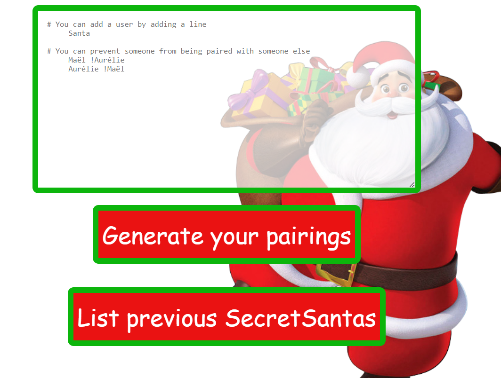
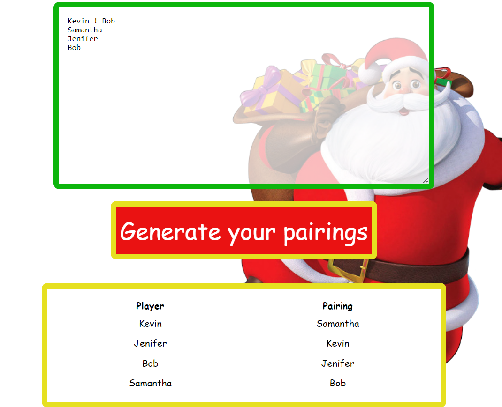

# Fullstack Application Django/React

## Installation method

1. Clone this Repo

   `git clone https://github.com/Cyrano71/TestUnifai.git`

2. cd into the TestBureauxLocaux folder:

   `cd TestUnifai`
   
2. deploy the backend by using the docker command :

   `docker compose up`
   
It will deploy a postgres database and a django rest api server.
For the django we use the following packages :
- psycopg2
- django-cors-headers

The docker deployment will automatically populate the input data into the database (see [this sample](backend/api/fixtures/sample.json) )
and will automatically create two users:
- one admin user with username = "admin", password = "1234"
- one normal user with  username = "jehan", password = "1234"

3. in a new terminal, cd into the frontend react app folder

   `cd frontend`

4. install the dependencies

   `npm install`

4. Start the frontend app

   `npm run start`

## Use the application

The url is : http://localhost:3000/

1. The homepage is really simple: you have a textbox to add new users and blacklist and two buttons to 
generate the pairings and to have the list of previous pairings



2. The result is a yellow box with the players and the pairings



3. You have also the previous pairing available :


## UniTests

### Backend Django unitests

1. You cd into the backend folder:

 `cd backend`

2. You provide the credentials of your dev database in the env file :

   ```
   DEV_DB_ENGINE= django.db.backends.mysql
   DEV_DB_HOST=localhost
   DEV_DB_NAME=django_db_unifai
   DEV_DB_PORT=3306
   DEV_DB_USER=
   DEV_DB_PASSWORD=
   ```

   [env file](backend/backend/.env)

3. You also need to install in your conda env the requirements:

 ```
 conda create --name mytestenv
 conda activate mytestenv
 pip3 install -r requirements.txt
 ```

4. You run the tests with this command :

 `python manage.py test`

You can find the code of the tests here : [tests code](backend/api/tests.py)

### Frontend React unitests

1. you cd into the frontend folder:

 `cd frontend`

2. you run the tests with commands :

 `npm test`

You can find the code of the tests here : 

[InputItemsList tests file](frontend/src/components/InputItemsList.test.js)

[ListItems tests file](frontend/src/components/ListItems.test.js)

[App test file](frontend/src/App.test.js)

## References

I was inspired by the code of arcanis. 
His code is really clean, smart, especially the way he handles the blacklist
in the input form.

https://github.com/arcanis/secretsanta/